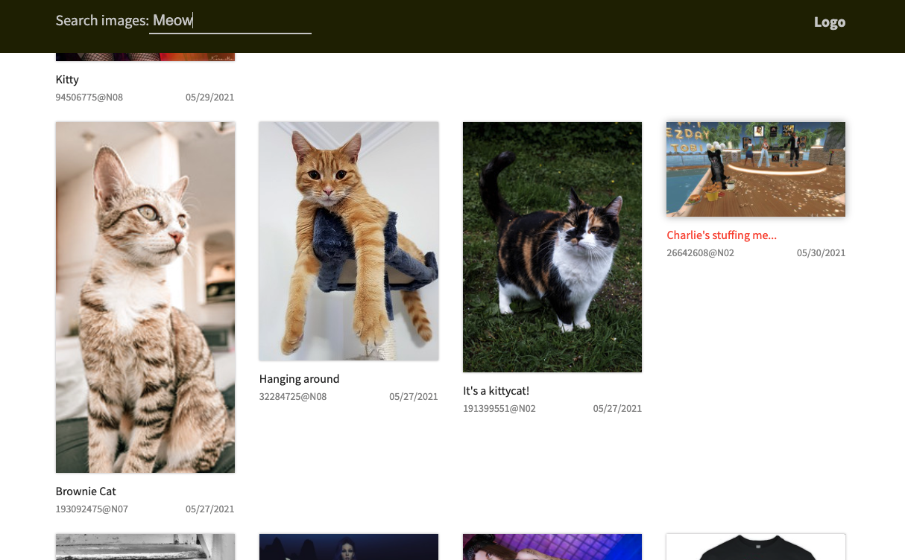

# Flickr search system



How to run:
```bash
yarn install
yarn start
```
Keys for queryes you can find inside .env file.

Techologies that I used:
### Typescript (Strongly Typed JS)
Typescript helps to do code better by strong typing and reduce potential errors in code.
### redux, thunk, @reduxjs/toolkit (https://redux-toolkit.js.org/)
Redux - state manager which helps to store and get data from any point of application;
Thunk - middleware for redux, helps to do async requests and put data from it in the store;
@reduxjs/toolkit - tools for better working of redux and typescript;
### re-ducks (https://github.com/alexnm/re-ducks)
Helps better scale application and code reading/understanding with this technologies easlier;
### BEM and SASS (https://en.bem.info/)
The idea behind it is to divide the user interface into independent blocks. Helps easiler reuse and support parts of code.
### eslint, prettier
Must have for clean code.
